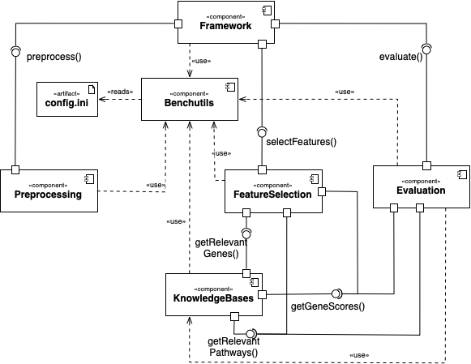
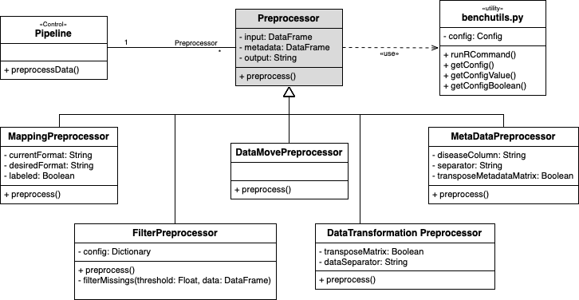
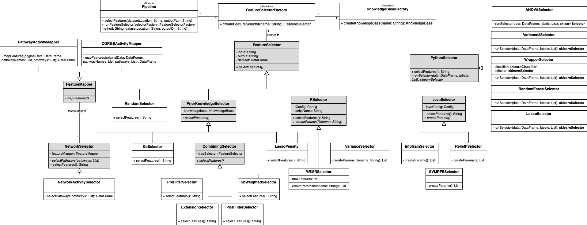
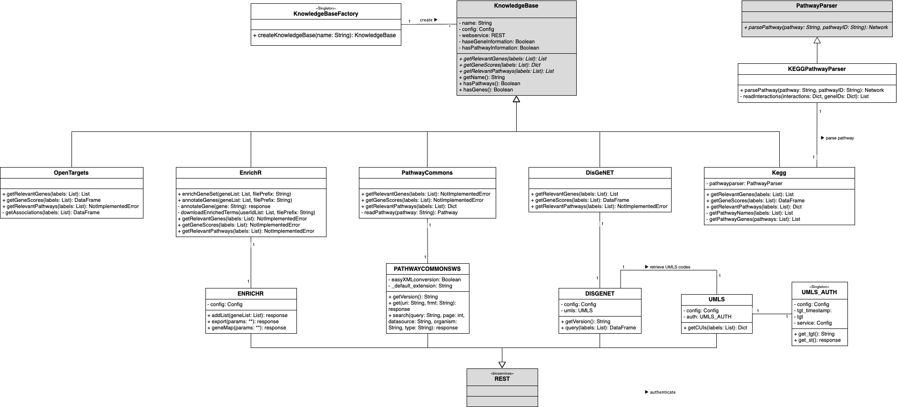
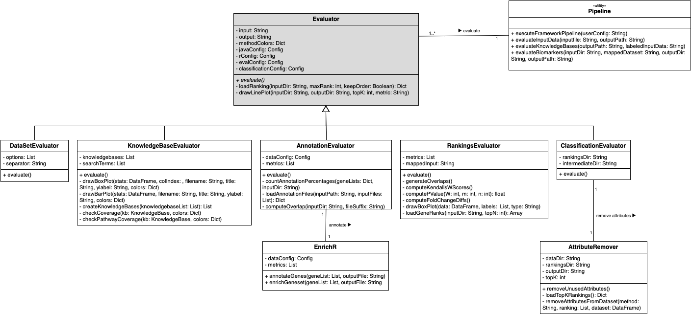

System Architecture
============================

Components Architecture
-------------------------

The image below describes the system components and their interaction points.
The interfaces correspond to concrete methods (see the actual components' class diagrams).

preprocessing Class Diagram
---------------------------
This module contains all classes related to preprocessing.
Every preprocessing functionality is encapsulated in its own class, which must inherit from the abstract :class:`preprocessing.Preprocessor` class (here marked in grey) and implement its :meth:`preprocessing.Preprocessor.preprocess` method

featureselection Class Diagram
------------------------------
This module contains all classes related to feature selection.
Every feature selector is encapsulated in its own class, which must inherit from the abstract :class:`featureselection.FeatureSelector` class or similar (abstract classes are marked in grey) and implement its :meth:`featureselection.FeatureSelector.selectFeatures` method.

knowledgebases Class Diagram
-----------------------------
This module contains all classes related to external knowledge retrieval.
Every knowledge base is encapsulated in two classes, which must inherit from the abstract :class:`knowledgebases.KnowledgeBase` class (the interface to the other components) and bioservices' REST class (the interface to the online web service). Abstract classes are marked in grey.

evaluation Class Diagram
---------------------------
This module contains all classes related to evaluation functionality.
Every evaluation functionality is encapsulated in its own class, which must inherit from the abstract :class:`evaluation.Evaluator` class (abstract classes are marked in grey) and implement its :meth:`evaluation.Evaluator.evaluate` method.

